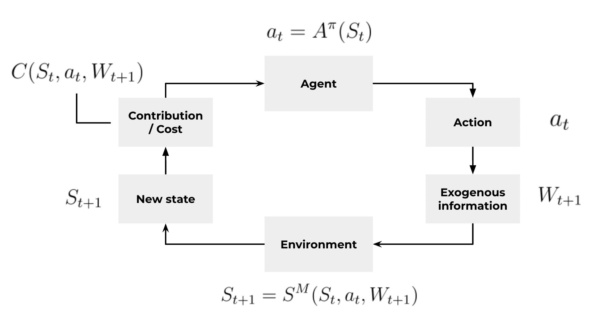
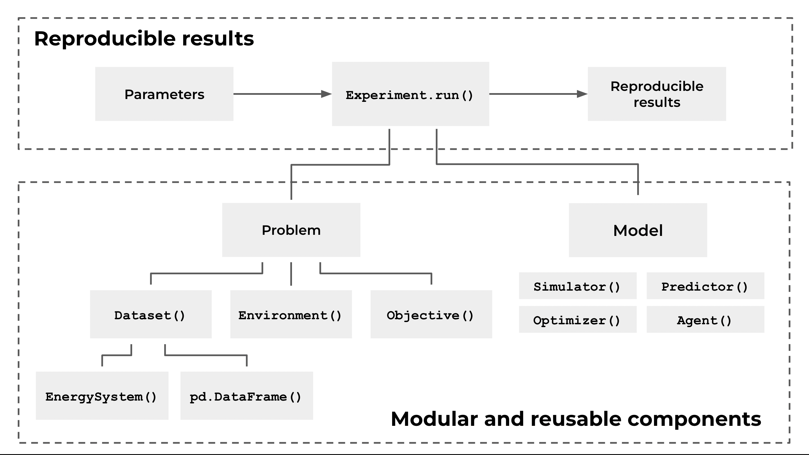

<div align="center">
	
<h2 style="margin-top: 0px;">
    ⚡ Open-source Python framework for modelling sequential decision problems in the energy sector
</h2>
</div>

[](https://opensource.org/licenses/MIT)
[](https://badge.fury.io/py/enerflow) 
[](#contributors)
[](https://join.slack.com/t/rebase-community/shared_invite/zt-1dtd0tdo6-sXuCEy~zPnvJw4uUe~tKeA) 
[](https://github.com/rebase-energy/enerflow)

**enerflow** is an open-source Python framework that enables energy data scientists and modellers to write modular and reproducible energy models that solves sequential decision problems. It is based on both OpenAI Gym (now [Gymnasium](https://github.com/Farama-Foundation/Gymnasium)) and [Warran Powell's sequential decision framework](https://castle.princeton.edu/rlso/). **enerflow** lets you: 

* 🛤️ Structure your code as modular and reusable components and adopt the "model first, then solve"-mantra;
* 🌱 Forumate your problems with datasets, environments and objectives;
* 🏗️ Build agents, predictors, optimizers and simulators to solve sequential decision problems;
* 🧪 Run parametrized experiments that generate reproducible results (code, data and parameters); and
* ➿ Run sweeps for benchmarking, scenario analysis and parameter tuning.

**⬇️ [Installation](#installation)**
&ensp;|&ensp;
**📖 [Documentation](https://docs.energydatamodel.org/en/latest/)**
&ensp;|&ensp;
**🚀 [Try out now in Colab](https://colab.research.google.com/github/rebase-energy/enerflow/blob/main/enerflow/examples/heftcom2024/notebook.ipynb)**
&ensp;|&ensp;
**👥 [Join Community Slack](https://join.slack.com/t/rebase-community/shared_invite/zt-1dtd0tdo6-sXuCEy~zPnvJw4uUe~tKeA)**

## The Sequential Decision Loop
**enerflow** allows to model sequential decison problems, where state information **$S_t$** is provided, an action **$a_t=A^{\pi}(S_t)$** is taken, exogenous information **$W_{t+1}$** is revealed, whereby a new state **$S_{t+1} = S^M(S_t, a_t, W_{t+1})$** is encountered and a cost/contribution **$C(S_t,a_t,W_{t+1})$** can be calculated. The sequential decision loop then repeats until the end of the evaluation/problem time. 



The goal is to find an agent policy **$\pi$** that maximizes the contribution (or minimizes the cost) over the full time horizon **$t \in [0, T]$**. Mathematically formulated as: 

$$
\begin{equation*}
\begin{aligned}
\max_{\pi \in \Pi} \quad & \mathbb{E}^{\pi} \bigg[ \sum_{t=0}^T C(S_t,A^{\pi}(S_t),W_{t+1}) \bigg| S_0 \bigg] \\
\textrm{s.t.} \quad & S_{t+1} = S^M(S_t,a_t,W_{t+1})\\
\end{aligned}
\end{equation*}
$$

## Modules and Components
**enerflow** consists of a set of components that serve as building blocks to create modular and reusable energy models. One of the main dependencies is [EnergyDataModel](https://github.com/rebase-energy/EnergyDataModel) that provides functionality to represent energy systems. The table below gives a summary of the available modules and concepts.

| Module         | Components     |
| :----          | :----            |
| 🔋&nbsp;`energysystem` | All energy asset and concept components defined by [EnergyDataModel](https://github.com/rebase-energy/EnergyDataModel) | 
| 📦&nbsp;`spaces` | [`BaseSpace`](), [`InputSpace`](), [`OutputSpace`]() [`StateSpace`]() [`ActionSpace`]() | 
| 🧩&nbsp;`problems` | [`Dataset`](), [`Environment`](), [`Objective`]() | 
| 🧩&nbsp;`models` | [`Simulator`](), [`Predictor`](), [`Optimizer`](), [`Agent`]() | 
| ➡️&nbsp;`experiment` | [`Experiment`]()| 

Below is a diagram of the components' relation to each other and how they together enable creation of reproducible results from energy models. 



## Framework Stepwise Approach
**enerflow** is about adopting a problem-centric, stepwise approach that follows the "model first, then solve"-mantra. The idea is to first gain a deep problem understanding before rushing to the solution. Or as Albert Einstien expressed it: 

> **"If I had an hour to solve a problem I'd spend 55 minutes thinking about the problem and five minutes thinking about solutions."**

Concretely, this means that problems are solved through the following steps: 

1. Define the considered **energy system**;
2. Define **state**, **action** and **exogenous** variables;
3. Create the **environment** and the transition function;
4. Define the **objective** (cost or contribution);
5. Create the **model** (simulator, predictor, optimizer and/or agent) to operate in environment; and
6. Run the **sequential decision loop** and model evaluate performance.

Steps 1-4 are about understanding the **problem** and steps 5-6 are about creating and evaluating the **solution**. 

## Basic Usage
Given a defined `env` (environment), `agent` (model) and `obj` (objective), the sequential decision loop is given by: 

```python
state = env.reset()
done = False
while done is not True:
    action = agent.act(state)
    state, exogeneous, done, info = env.step(action)
    cost = obj.calculate(state, action, exogeneous)

env.close()
```

For a full walkthrough go to the [documentation](https://docs.enerflow.org/en/latest/walkthrough.html#) or open in [Colab](https://colab.research.google.com/github/rebase-energy/enerflow/blob/main/enerflow/examples/walkthrough/notebook.ipynb). 

## Installation
Install the **stable** release: 
```bash
pip install enerflow
```

Install the **latest** release: 
```bash
pip install git+https://github.com/rebase-energy/enerflow
```

Install in editable mode for **development**: 
```bash
git clone https://github.com/rebase-energy/enerflow.git
cd enerflow
pip install -e . 
```

## Contributors
This project uses [allcontributors.org](https://allcontributors.org/) to recognize all contributors, including those that don't push code. 

<!-- ALL-CONTRIBUTORS-LIST:START - Do not remove or modify this section -->
<!-- prettier-ignore-start -->
<!-- markdownlint-disable -->
<table>
  <tbody>
    <tr>
      <td align="center" valign="top" width="14.28%"><a href="https://github.com/sebaheg"><br /><sub><b>Sebastian Haglund</b></sub></a><br /><a href="#code-sebaheg" title="Code">💻</a></td>
      <td align="center" valign="top" width="14.28%"><a href="https://github.com/dimili"><br /><sub><b>dimili</b></sub></a><br /><a href="#code-dimili" title="Code">💻</a></td>
      <td align="center" valign="top" width="14.28%"><a href="https://github.com/rocipher"><br /><sub><b>Mihai Chiru</b></sub></a><br /><a href="#code-rocipher" title="Code">💻</a></td>
    </tr>
  </tbody>
</table>

<!-- markdownlint-restore -->
<!-- prettier-ignore-end -->

<!-- ALL-CONTRIBUTORS-LIST:END -->

## Licence
This project uses the [MIT Licence](LICENCE.md).  


